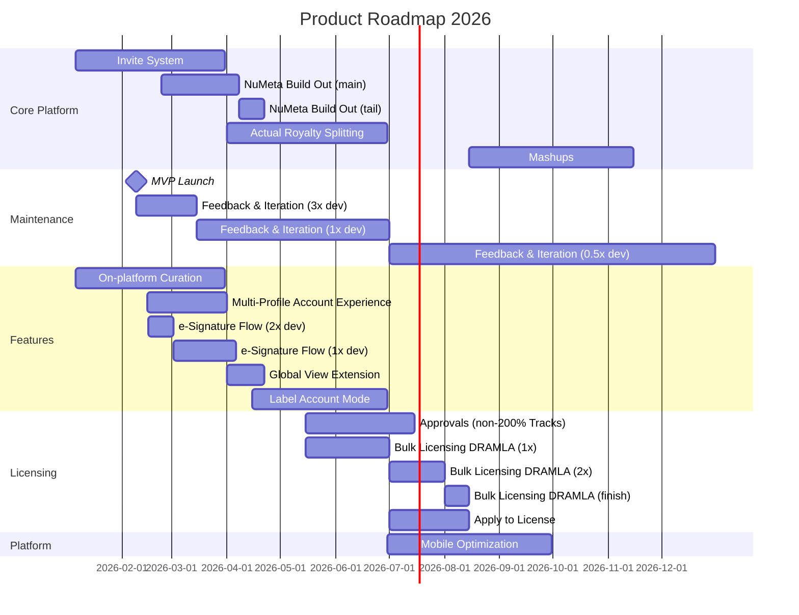

# Product Roadmap Timeline

> **Developer Unit**: 1 height unit = 1.25 developers
> **Timeline**: Q1 2026 - Q4 2026
> **MVP Launch**: February 9, 2026

---

## Feature Registry

| ID | Feature | Category | Start | End | Phases |
|----|---------|----------|-------|-----|--------|
| 1 | NuMeta Build Out | Core Platform | Feb 23 | Q2-Start + 3wks | Phase 1: 2.5 devs → Apr 8; Phase 2: 0.625 devs (2 wks tail) |
| 2 | Feedback & Iteration (MVP Launch Support) | Maintenance | Feb 9 | Ongoing | Phase 1: 3.75 devs (Feb 9 → Mid-Mar); Phase 2: 1.25 devs (Mid-Mar → Q3-Start); Phase 3: 0.625 devs (Q3+ indefinitely) |
| 3 | Invite System | Core Platform | Q1-Start | End of March | 1.25 devs |
| 4 | On-platform Curation | Features | Q1-Start | End of March | 1.25 devs |
| 5 | Custom e-Signature Flow | Features | Feb 16 | Apr 6 | Phase 1: 2.5 devs (2 wks); Phase 2: 1.25 devs (5 wks) |
| 6 | Multi-Profile Account Experience | Features | Q1-Mid | Q2-Start | 1.25 devs |
| 7 | Global View (Multi-Profile Extension) | Features | Q2-Start | Q2-Start + 3wks | 1.25 devs (tail-end refinement) |
| 8 | Label Account Mode | Features | Q2 Early-Mid | Q2-End | Phase 1: 2.5 devs (1 wk); Phase 2: 1.25 devs (4 wks) |
| 10 | Actual Royalty Splitting | Core Platform | Q2-Start | Q2-End | 2.5 devs |
| 11 | Gathering Approvals for non-200% owned Tracks | Licensing | Q2-Mid | Q2-Mid + 2mo | 1.875 devs (1.5 units) |
| 12 | Bulk Licensing for DRAMLA Originals | Licensing | Q2-Mid | Q3-Mid + 2wks | Phase 1: 1.25 devs (Q2-Mid → Q3-Start); Phase 2: 2.5 devs (Q3, 1 mo); Phase 3: 1.25 devs (2 wks finish) |
| 13 | Mobile Optimization | Platform | Q2-End | Q3-End | 2.5 devs |
| 14 | "Apply to License" | Licensing | Q3-Start | Q3-Mid | 1.25 devs |
| 15 | Mashups | Core Platform | Q3-Mid | Q4-Mid | 2.5 devs |

---

## Categories

- **Core Platform** (Red): Major platform infrastructure (NuMeta, Royalty Splitting, Mashups)
- **Maintenance** (Green): Ongoing support, feedback, iteration
- **Features** (Rose): User-facing features (e-Signature, Curation, Multi-Profile, Global View, Label Accounts)
- **Licensing** (Amber): Licensing workflows (Approvals, Bulk Licensing, Apply to License)
- **Platform** (Teal): Cross-platform optimization

---

## Detailed Timeline with Phases

### Q1 2026

| Week Starting | Feature | Dev Units | Developers |
|---------------|---------|-----------|------------|
| Jan 6 | Invite System | 1 | 1.25 |
| Jan 6 | On-platform Curation | 1 | 1.25 |
| Feb 9 | **MVP LAUNCH** | - | - |
| Feb 9 | Feedback & Iteration (Phase 1) | 3 | 3.75 |
| Feb 15 | Multi-Profile Account Experience | 1 | 1.25 |
| Feb 16 | Custom e-Signature Flow (Phase 1) | 2 | 2.50 |
| Feb 23 | NuMeta Build Out (Phase 1) | 2 | 2.50 |
| Mar 2 | Custom e-Signature Flow (Phase 2) | 1 | 1.25 |
| Mar 15 | Feedback & Iteration (Phase 2) | 1 | 1.25 |
| Mar 31 | Invite System ends | - | - |
| Mar 31 | On-platform Curation ends | - | - |

### Q2 2026

| Week Starting | Feature | Dev Units | Developers |
|---------------|---------|-----------|------------|
| Apr 1 | Multi-Profile Account Experience ends | - | - |
| Apr 1 | Global View (Multi-Profile Extension) | 1 | 1.25 |
| Apr 1 | Actual Royalty Splitting | 2 | 2.50 |
| Apr 6 | Custom e-Signature Flow ends | - | - |
| Apr 8 | NuMeta Build Out (Phase 2 - tail) | 0.5 | 0.625 |
| Apr 15 | Label Account Mode (Phase 1) | 2 | 2.50 |
| Apr 22 | NuMeta Build Out ends | - | - |
| Apr 22 | Label Account Mode (Phase 2) | 1 | 1.25 |
| May 15 | Gathering Approvals (non-200% Tracks) | 1.5 | 1.875 |
| May 15 | Bulk Licensing DRAMLA (Phase 1) | 1 | 1.25 |
| Jun 30 | Label Account Mode ends | - | - |
| Jun 30 | Actual Royalty Splitting ends | - | - |
| Jun 30 | Mobile Optimization begins | 2 | 2.50 |

### Q3 2026

| Week Starting | Feature | Dev Units | Developers |
|---------------|---------|-----------|------------|
| Jul 1 | Feedback & Iteration (Phase 3) | 0.5 | 0.625 |
| Jul 1 | Bulk Licensing DRAMLA (Phase 2) | 2 | 2.50 |
| Jul 1 | "Apply to License" | 1 | 1.25 |
| Jul 15 | Gathering Approvals ends | - | - |
| Aug 1 | Bulk Licensing DRAMLA (Phase 3) | 1 | 1.25 |
| Aug 15 | Mashups | 2 | 2.50 |
| Aug 15 | Bulk Licensing DRAMLA ends | - | - |
| Sep 30 | Mobile Optimization ends | - | - |

### Q4 2026

| Week Starting | Feature | Dev Units | Developers |
|---------------|---------|-----------|------------|
| Oct 1 | Mashups continues | 2 | 2.50 |
| Nov 15 | Mashups ends | - | - |
| Ongoing | Feedback & Iteration (Phase 3) | 0.5 | 0.625 |

---

## Gantt Data (Mermaid-Compatible)



---

## Quarterly Summary

### Q1 (Jan - Mar 2026)

- **Focus**: MVP Launch & Core Platform Foundation
- **Key Milestone**: MVP Launch February 9
- **Key Deliverables**: Invite System, On-platform Curation
- **Starting**: Custom e-Signature, Multi-Profile Accounts, NuMeta Build Out
- **Peak Dev Capacity**: ~10 developers (post-launch)

### Q2 (Apr - Jun 2026)

- **Focus**: Account Features & Financial Infrastructure
- **Key Deliverables**: Global View, Label Account Mode, Actual Royalty Splitting, Custom e-Signature (completion)
- **Starting**: Gathering Approvals, Bulk Licensing DRAMLA, Mobile Optimization
- **Peak Dev Capacity**: ~10 developers

### Q3 (Jul - Sep 2026)

- **Focus**: Licensing & Mobile
- **Key Deliverables**: Bulk Licensing DRAMLA, Apply to License, Mobile Optimization, Gathering Approvals
- **Starting**: Mashups
- **Dev Capacity**: ~7-8 developers

### Q4 (Oct - Dec 2026)

- **Focus**: Feature Completion
- **Key Deliverables**: Mashups (completion)
- **Ongoing**: Feedback & Iteration (maintenance mode)
- **Dev Capacity**: ~3 developers

---

## JSON Data Export

```json
{
  "roadmap": {
    "year": 2026,
    "devUnitMultiplier": 1.25,
    "mvpLaunch": "2026-02-09",
    "features": [
      {
        "id": 1,
        "name": "NuMeta Build Out",
        "category": "core",
        "phases": [
          { "start": "2026-02-23", "end": "2026-04-08", "devUnits": 2, "description": "Main build" },
          { "start": "2026-04-08", "end": "2026-04-22", "devUnits": 0.5, "description": "Tail-end support" }
        ]
      },
      {
        "id": 2,
        "name": "Feedback & Iteration",
        "category": "maintenance",
        "phases": [
          { "start": "2026-02-09", "end": "2026-03-15", "devUnits": 3, "description": "MVP launch support" },
          { "start": "2026-03-15", "end": "2026-07-01", "devUnits": 1, "description": "Standard support" },
          { "start": "2026-07-01", "end": null, "devUnits": 0.5, "description": "Maintenance mode (ongoing)" }
        ]
      },
      {
        "id": 3,
        "name": "Invite System",
        "category": "core",
        "start": "2026-01-06",
        "end": "2026-03-31",
        "devUnits": 1
      },
      {
        "id": 4,
        "name": "On-platform Curation",
        "category": "features",
        "start": "2026-01-06",
        "end": "2026-03-31",
        "devUnits": 1
      },
      {
        "id": 5,
        "name": "Custom e-Signature Flow",
        "category": "features",
        "phases": [
          { "start": "2026-02-16", "end": "2026-03-02", "devUnits": 2, "description": "Initial build" },
          { "start": "2026-03-02", "end": "2026-04-06", "devUnits": 1, "description": "Completion" }
        ]
      },
      {
        "id": 6,
        "name": "Multi-Profile Account Experience",
        "category": "features",
        "start": "2026-02-15",
        "end": "2026-04-01",
        "devUnits": 1
      },
      {
        "id": 7,
        "name": "Global View (Multi-Profile Extension)",
        "category": "features",
        "start": "2026-04-01",
        "end": "2026-04-22",
        "devUnits": 1,
        "description": "Tail-end refinement of multi-profile support"
      },
      {
        "id": 8,
        "name": "Label Account Mode",
        "category": "features",
        "phases": [
          { "start": "2026-04-15", "end": "2026-04-22", "devUnits": 2, "description": "Initial setup" },
          { "start": "2026-04-22", "end": "2026-06-30", "devUnits": 1, "description": "Main development" }
        ]
      },
      {
        "id": 10,
        "name": "Actual Royalty Splitting",
        "category": "core",
        "start": "2026-04-01",
        "end": "2026-06-30",
        "devUnits": 2
      },
      {
        "id": 11,
        "name": "Gathering Approvals for non-200% owned Tracks",
        "category": "licensing",
        "start": "2026-05-15",
        "end": "2026-07-15",
        "devUnits": 1.5
      },
      {
        "id": 12,
        "name": "Bulk Licensing for DRAMLA Originals",
        "category": "licensing",
        "phases": [
          { "start": "2026-05-15", "end": "2026-07-01", "devUnits": 1, "description": "Initial work" },
          { "start": "2026-07-01", "end": "2026-08-01", "devUnits": 2, "description": "Main development" },
          { "start": "2026-08-01", "end": "2026-08-15", "devUnits": 1, "description": "Wrap-up" }
        ]
      },
      {
        "id": 13,
        "name": "Mobile Optimization",
        "category": "platform",
        "start": "2026-06-30",
        "end": "2026-09-30",
        "devUnits": 2
      },
      {
        "id": 14,
        "name": "Apply to License",
        "category": "licensing",
        "start": "2026-07-01",
        "end": "2026-08-15",
        "devUnits": 1
      },
      {
        "id": 15,
        "name": "Mashups",
        "category": "core",
        "start": "2026-08-15",
        "end": "2026-11-15",
        "devUnits": 2
      }
    ]
  }
}
```
